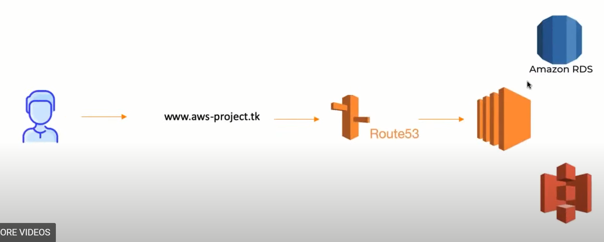
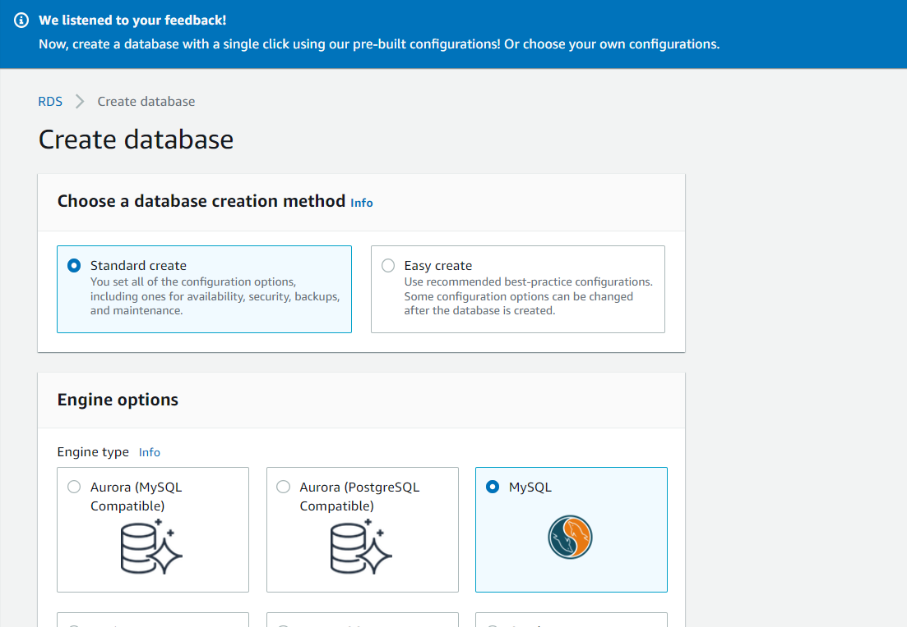
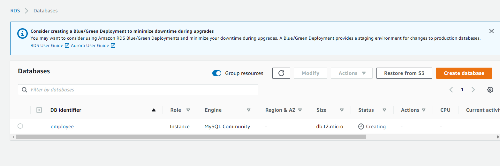
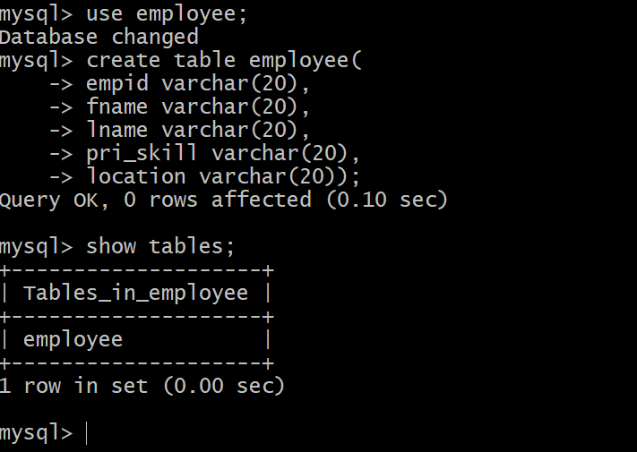
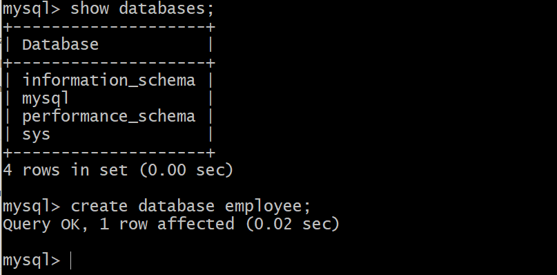
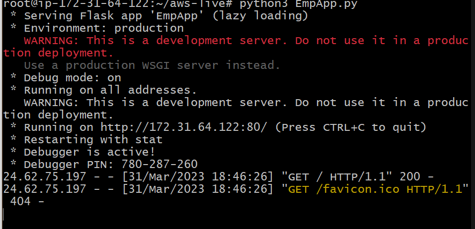
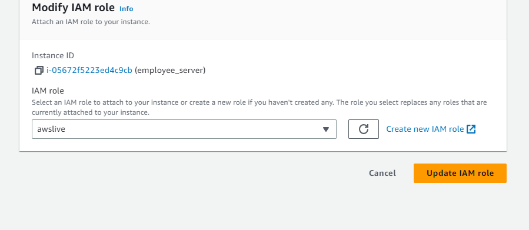

# AWS End-to-end Website Project:
>This project I deployed an EC2 web application built on python/flask, which connected and stored data to an RDS Aurora database.

1) create RDS aurora -
free tier / public

2) create S3 bucket
3) Configure Ubuntu EC2 instance - 
4) ssh into EC2, run following commands:
<code>apt-get update / 
apt-get install mysql-client - (allow connect to rds) </code>
5) Connect to RDS from Ec2 - connect to endpoint - employee.cfjddbvftwzq.us-east-1.rds.amazonaws.com

6) Create employee table: 

8) Add Mysql inbound rule for security group
/ when enter information will be stored in RDS database.

10) upload code to Github repository
11) clone code to ec2 instance
12) install necessary dependencies  
<code>

sudo apt-get install mysql-client 

sudo apt-get install python3

sudo apt-get install python3-flask

sudo apt-get install python3-pymysql

sudo apt-get install python3-boto3

</code>

13) for running application
sudo python3 Empapp.py

14) Create AWS role allowing Administrator access to allow S3 access to EC2 instance / attach role to EC2 

